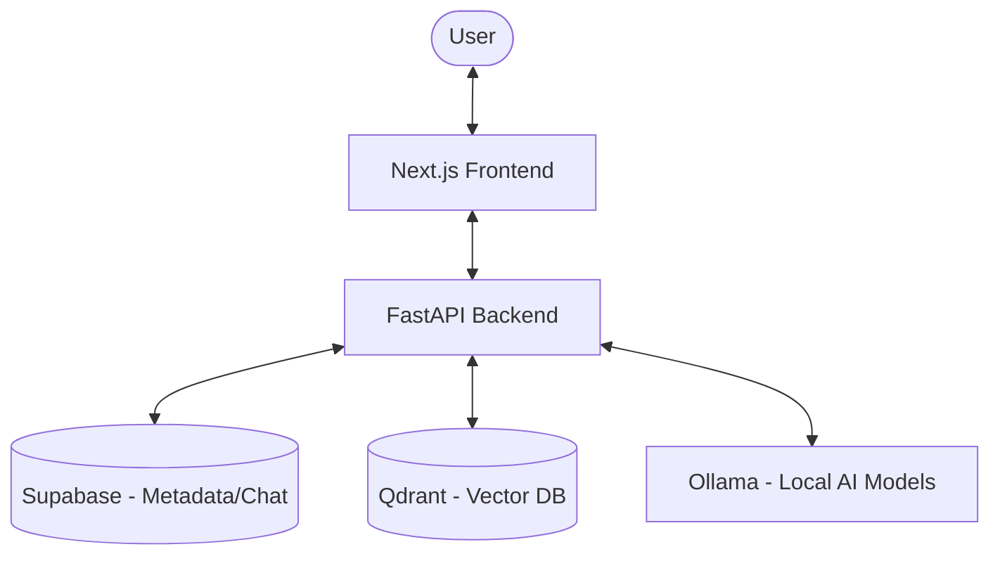

# DocChat: Local AI Document Chat Platform

DocChat is a full-stack application that enables users to upload documents (PDF, Word, PowerPoint, Markdown, Text) and chat with them using local AI. It leverages local LLMs for retrieval-augmented generation (RAG), featuring persistent chat sessions, advanced token tracking, and seamless integration between a Next.js frontend and a FastAPI backend.

---

## Table of Contents

- [Features](#features)
- [Architecture Overview](#architecture-overview)
- [Backend](#backend)
  - [API Endpoints](#api-endpoints)
  - [Supabase Schema](#supabase-schema)
  - [Configuration](#configuration)
  - [Setup & Running](#backend-setup--running)
- [Frontend](#frontend)
  - [Key Components](#key-components)
  - [State Management](#state-management)
  - [Setup & Running](#frontend-setup--running)
- [Development Workflow](#development-workflow)

---

## Features

- **Multi-Format Document Support**: Process PDF, DOCX, PPTX, TXT, and MD files.
- **Local AI Processing**: Uses Ollama for local LLM and embedding generation (e.g., Llama 3.2, Nomic Embed).
- **VLM Integration**: Visual Language Model support for extracting and summarizing images from documents.
- **Vector Search**: High-performance retrieval using Qdrant vector database.
- **Persistent Conversations**: Full chat history and document metadata stored in Supabase.
- **Advanced Token Analytics**: Detailed breakdown of prompt, completion, and reasoning tokens.
- **Reasoning Model Support**: Automatically detects and calculates reasoning tokens from models like DeepSeek R1.
- **Dynamic Model Selection**: Switch between different LLMs and VLMs directly from the UI.
- **Modern UI/UX**: Responsive Next.js interface with Tailwind CSS, Framer Motion, and shadcn/ui components.

---

## Architecture Overview



- **Frontend**: Next.js 15, TypeScript, Tailwind CSS, Zustand (state management).
- **Backend**: FastAPI (Python), Document parsing (PyMuPDF, python-docx, etc.), RAG logic.
- **Storage**: Supabase (PostgreSQL) for structured data; Qdrant for vector embeddings.
- **AI Engine**: Ollama (compatible with OpenAI-like API).

---

## Backend

### API Endpoints

- `POST /upload` — Upload and process a document (links to `chat_id`).
- `POST /chat` — Send a query with document context and receive an AI response.
- `POST /session/chat-session` — Create a new chat session.
- `GET /session/list` — List all chat sessions for a user.
- `GET /session/{chat_id}/conversations` — Get processed files for a specific chat.
- `GET /session/{chat_id}/messages` — Retrieve message history for a chat.
- `DELETE /session/{chat_id}` — Wipe a session and its associated vectors/files.
- `GET /models` — List available and configured models.
- `GET /models/health` — Check status of Ollama and Qdrant services.

### Supabase Schema

The application requires three main tables:

- `chats`: Stores session metadata (`chat_id`, `user_id`, `title`).
- `chat_documents`: Links files to sessions (`conversation_id`, `file_name`, `file_type`).
- `chat_messages`: Stores the Q&A history, including detailed token analytics (`prompt_tokens`, `completion_tokens`, `total_tokens`, `reasoning_tokens`, `context_tokens`, `history_tokens`, `query_tokens`) and the `model_used`.

### Configuration

Managed via `backend/config.yaml`:

```yaml
llm:
  model_name: llama3.2:latest
  host: http://localhost:11434
vlm:
  model_name: qwen2.5vl:3b
  host: http://localhost:11434
embedding:
  model_name: nomic-embed-text
```

### Backend Setup & Running

1. **Install Dependencies**:
   ```sh
   cd backend
   pip install -r requirements.txt
   ```
2. **Environment Setup**: Create a `.env` file with:
   - `SUPABASE_URL`, `SUPABASE_KEY`
   - `QDRANT_HOST`, `QDRANT_PORT` (default: localhost:6333)
3. **Run Server**:
   ```sh
   uvicorn app.main:app --reload
   ```

---

## Frontend

### Key Components

- `app-sidebar.tsx`: Navigation and chat history.
- `chatArea.tsx`: Interactive chat interface with message bubbles.
- `ModelSelector.tsx`: Dropdown for switching models with health status.
- `uploadSidebar.tsx`: Drag-and-drop file upload with progress tracking.

### State Management

Uses **Zustand** and **React Context** to manage:

- Active `chatId` and document selection.
- Real-time message updates.
- App-wide loading states and notifications.

### Frontend Setup & Running

1. **Install Dependencies**:
   ```sh
   cd frontend
   pnpm install
   ```
2. **Environment Setup**: Create a `.env` file with:
   - `NEXT_PUBLIC_BACKEND_URL=http://localhost:8000`
   - `NEXT_PUBLIC_USER_ID=your_id`
3. **Run App**:
   ```sh
   pnpm dev
   ```

---

## Development Workflow

1. **Ollama**: Ensure Ollama is running (`ollama serve`).
2. **Qdrant**: Run via Docker: `docker run -p 6333:6333 qdrant/qdrant`.
3. **Supabase**: Ensure your project tables are set up as per the schema.
4. **Backend**: Start the FastAPI server.
5. **Frontend**: Start the Next.js dev server.
